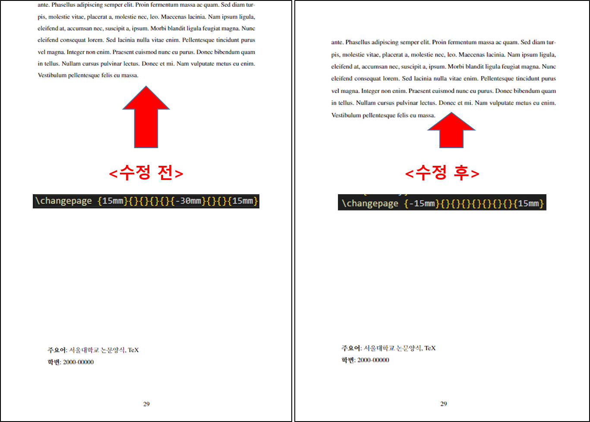

# Ph.D. Thesis (Disseration) Template

## Seoul National University 
### (default: Electrical and Computer Engineering) 
#### updated by [SH Park](https://www.linkedin.com/in/seong-hyeon-park-884296160/)

This version is the updated version of $\LaTeX$ format provided by [SNU ECE](https://ee.snu.ac.kr/community/notice/academic?bm=v&bbsidx=48811)

## What's Different?

## Updates, Dec. 2023:
### 1. 인준지 심사위원 (인) 추가

### 2. bibtex BSTCTL 추가
You can automatically control the length of the reference author list. If you don't want to use this feature or if you want to change the feature, comment the lines from 3 to 7 of [Ref.bib](./format_latex/Ref.bib) file.

### 3. 전공명: `전기 정보 공학부`에서 `전기정보공학부`로 변경

## Updates, Aug. 2022:
### 1. Nomenclature Page Generation
You have to compile the tex file with makeindex as follows:
    
    makeindex -s nomencl.ist -t "파일명.nlg" -o "파일명.nls" "파일명.nlo"
   

     
   

### 2. Table/Figure Name Generation
You can generate 'Table' (or 'Figure') in List of Tables (Figures) page. If you don't want to use this feature, comment the lines from 51 to 65 of [snuee.cls](./format_latex/snuee.cls) file.
   

     
   

### 3. Beautiful Appendix Generation
You can generate $beautiful$ appendix in ToC (Table of Contents) and main-text as follows:
   

     
   

### 4. Korean Abstract Margin
Upper margin of the abstract (in Korean) section is changed. I left the original style code for the users as:

    \changepage {-15mm}{}{}{}{}{}{}{}{15mm} % 수정된 초록과 감사의 글을 위한 여백 재설정!
    % \changepage {15mm}{}{}{}{}{-30mm}{}{}{15mm} %초록과 감사의 글을 위한 여백 재설정, 고치거나 삭제하지 마십시오. (원래 포맷)
   

     
   

## Notes
### 1. How to Change the Name of Your Department
You can change your department name by changing the line 248 and 256 in [snuee.cls](./format_latex/snuee.cls) file.
   

     
   

Please refer to the official sample thesis file from your department for minor issues!!! 

(ex: abstract format is different from that of Department of Mechanical and Aerospace Engineering)
   

     
   

### 2. Overleaf Compatibility
You have to select 2021 or the older TeX Live version (IDK why ㅠㅠ). If you're using [Overleaf](https://www.overleaf.com/), just compiling with pdfLaTeX will generate the beautiful pdf file without setting makeindex for nomenclature generation.
   

     
   

